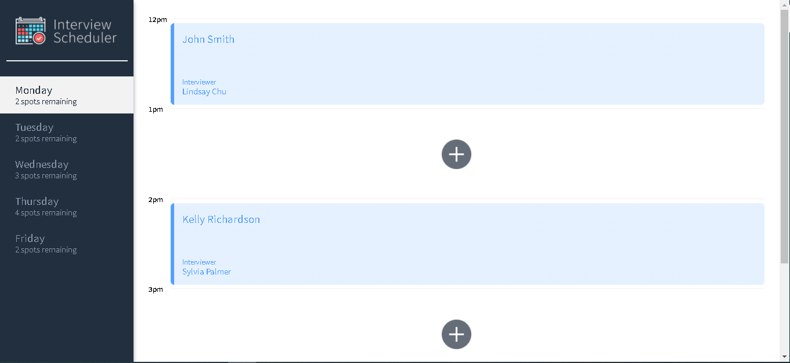
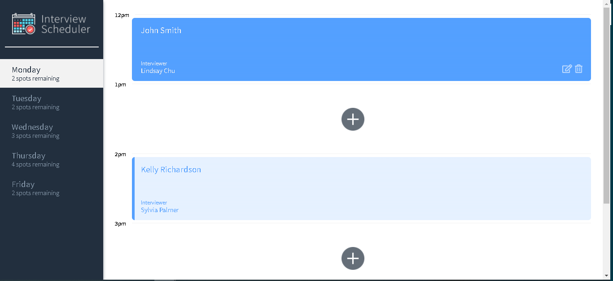
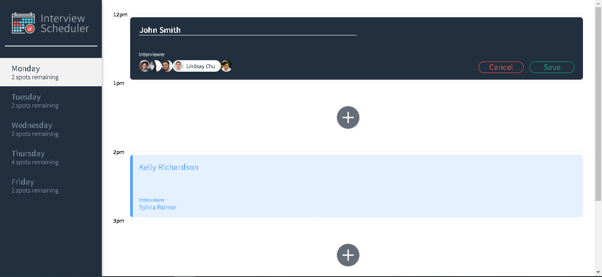

# Interview Scheduler

A single page react app that makes API calls then populates the page with interviews. Adding deleting or editing with result in an API call which will ensure that any changes are persistent. Demonstration of props, custom hooks, selectors and a variety of testing environments.

Create an appointment with available interviewers! Update existing interviews or cancel an interview all from one location.

### Nifty Features
* Spots update in side panel as interviews are setup or deleted
* Interviewers are only displayed if their availability needs are met for that day
* When a day has no more availability it will appear grayed out
## Screenshots

<center></center>

<center></center>

<center></center>\

## Setup

Install dependencies with `npm install`.

## Running Webpack Development Server

```sh
npm start
```

## Running Jest Test Framework

```sh
npm test
```

## Running Storybook Visual Testbed

```sh
npm run storybook
```
